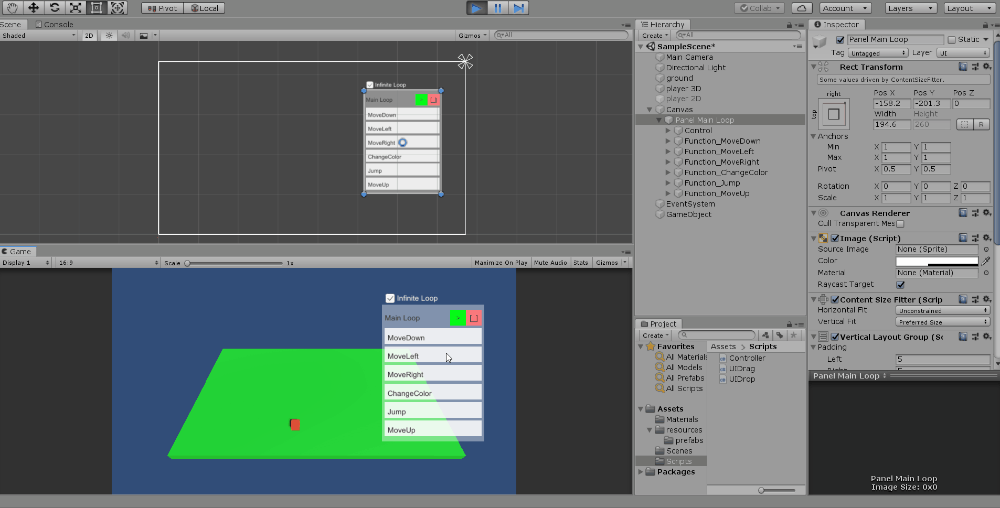
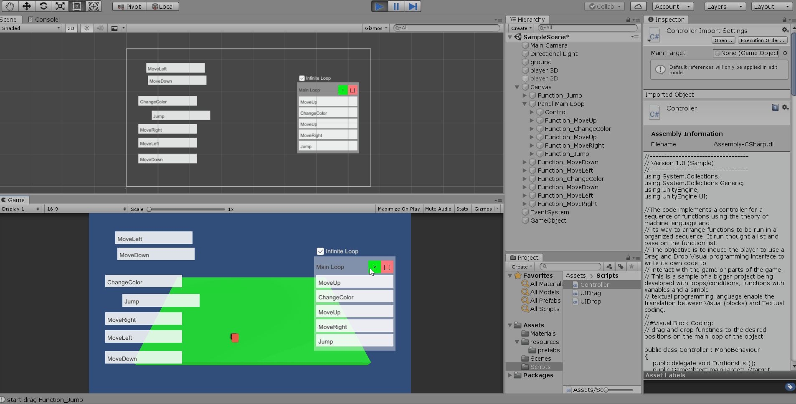

# Simple-InGame-Visual-Programming-for-Unity
A simple visual programming language using drag and drop blocks for games in unity

# A seed for a visual programming language
Aiming to create a simple way to enable in game programming, I developed this simple project using drag and drop functionalities so the players can have a visual programming interface where is possible to place a list of functions to run in sequence.
The objective of this project is to serve as a seed for programmers to create new educational forms of interacting with a game using computational logic and induce the players to think and create his own logic to interact with whole/or part of a game.

# Ongoing process
This is a sample of a bigger project being developed with loops, conditions, variables, functions with variables and I'm also thinking about creating a simple textual programming language to enable the translation between Visual (blocks) and Textual coding.

# Visual block coding:
Uses the drag and drop scripts from https://github.com/danielcmcg/Unity-UI-Nested-Drag-and-Drop. The functions are dragged and dropped inside the main loop

# See in action

